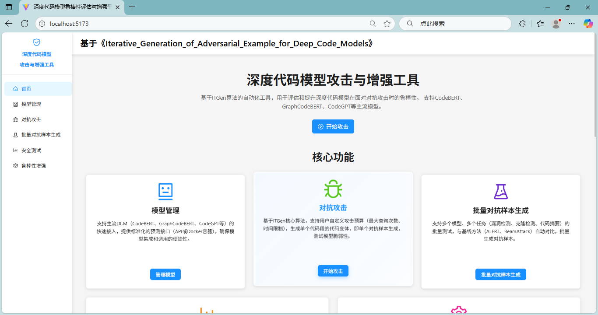

This project is the open-source repository of ITGen_web, containing the frontend demo and backend demo of ITGen_web.

---

### Video Demonstration

---
### Our Web

URL: http://8.148.254.195/

### About Our Work

#### ITGen

GitHub: https://github.com/unknownhl/ITGen

Cite: @inproceedings{huang2025iterative,
  title={Iterative Generation of Adversarial Example for Deep Code Models},
  author={Huang, Li and Sun, Weifeng and Yan, Meng},
  booktitle={2025 IEEE/ACM 47th International Conference on Software Engineering (ICSE)},
  pages={623--623},
  year={2025},
  organization={IEEE Computer Society}
}
